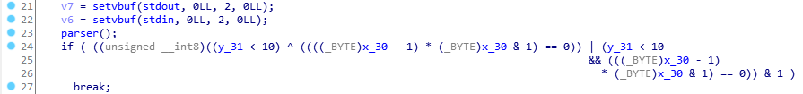
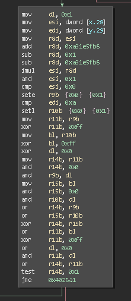

llvm-deobfuscator
=================

Performs the inverse operation of the control flow flattening pass performed by
LLVM-Obfuscator. It does not yet undo the bogus control flow and expression
substitution passes.

Makes use of the BinaryNinja SSA form to determine all usages of the state variable. To
use, right click on the state variable and click "Deobfuscate (OLLVM)".  Note that the
instruction writing to the state variable is typically in the first basic block of the
function, and looks something like:

```asm
mov dword [rbp-0xf8], 0x962e7c4e
```

with minor variations in the large constant and variable offset.

For more information on llvm obfuscator itself, the [source][llvm-obfuscator] is an
obvious ground truth :)

## Installation

Should just be able to git clone the repository into your plugins repository.

## Other Protections

After Control Flow Flattening has been removed, it is trivial to recognize opaque
predicates (note that these are not removed by the binja opaque predicate plugin). In IDA,
they look like this:



The opaque predicate is something of the form (though may be quite a bit uglier due to
expression substitution):

```c
if ((y < 10) | (x*(x-1)) % 2 == 0)
	break;
```

In binja, it looks something like:



The identifying features here are the load to globals `y` and `x` (though this may change
in the future as the LLVM-obfuscator guys have acknowledged this). For this case, you can
simply always take the branch using binja. This will be automated later.

[llvm-obfuscator]: https://github.com/obfuscator-llvm/obfuscator/tree/llvm-4.0/lib/Transforms/Obfuscation
